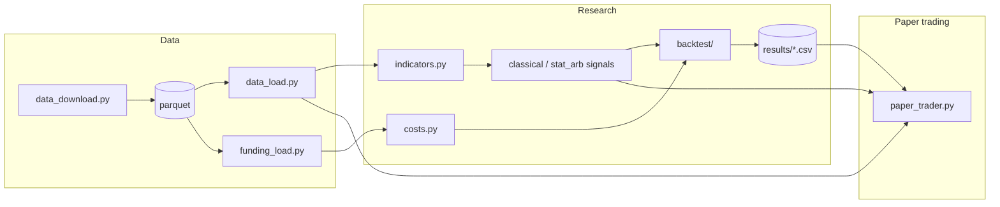

# QuantTrading Architecture

Research and paper-trading codebase for crypto perpetual futures strategies.

## Directory layout

```
QuantTrading/
├── src/
│   ├── data/                  # Market data I/O
│   │   ├── data_load.py       # Load klines from parquet
│   │   ├── data_download.py   # Download klines + funding from Binance
│   │   └── funding_load.py    # Load funding rates from parquet
│   │
│   ├── backtest/              # Shared backtest infrastructure
│   │   ├── directional.py     # Single-asset backtest (fees, slippage, funding, vol targeting)
│   │   └── evaluation.py      # Walk-forward train/val/test splits + OOS gates
│   │
│   ├── strategy/
│   │   ├── indicators.py      # OHLCV prep, resampling, technical indicators
│   │   ├── classical/         # Directional signal generators
│   │   │   ├── momentum.py    # ts_momentum, dual_ma
│   │   │   ├── mean_reversion.py
│   │   │   └── regime.py      # ADX regime switcher
│   │   ├── stat_arb/          # Pairs statistical arbitrage
│   │   │   ├── engine.py      # Spread signals + two-leg backtest
│   │   │   ├── scan.py        # Exploratory pair scan
│   │   │   └── evaluation.py  # Rolling-beta walk-forward OOS
│   │   └── predictive/        # ML direction forecasting (frozen)
│   │
│   └── trading/
│       ├── costs.py           # Unified fee / slippage / funding config
│       └── paper_trader.py    # Binance testnet execution
│
├── scripts/                   # CLI entry points
├── data/                      # Parquet store (klines, funding)
├── results/                   # Backtest CSV outputs
└── notebooks/                 # Research notebooks
```

## Data flow



## Strategy families

| Package | Purpose | Status |
|---------|---------|--------|
| `strategy.classical` | Directional momentum, mean-reversion, regime signals | **Active** — dual_ma BTC 1h passes OOS |
| `strategy.stat_arb` | Pairs spread reversion (BTC/ETH, etc.) | Research — walk-forward failed OOS |
| `strategy.predictive` | ML next-candle direction | **Frozen** — no edge after costs |

## Backtest pipeline

1. **Load** klines via `data_load.load_data`, resample with `indicators.resample_ohlcv`.
2. **Signal** from `classical.*` or `stat_arb.engine`.
3. **Simulate** with `backtest.directional` (single asset) or `stat_arb.engine.backtest_spread_signal` / `stat_arb.evaluation.backtest_spread_rolling` (pairs).
4. **Evaluate** walk-forward splits (train 2024, val 2025, test 2026) via `backtest.evaluation` or `stat_arb.evaluation`.
5. **Gate** on test Sharpe ≥ 0.5, max drawdown ≥ −25%, stress Sharpe ≥ 0.3 at 1.5× costs.

## Cost model

All backtests use `src/trading/costs.py`:

| Cost | Directional | Stat arb |
|------|-------------|----------|
| Trading fee | 5 bps per turnover | 5 bps per leg (entry + exit) |
| Slippage | 2 bps per turnover | 2 bps per leg |
| Funding | 8h rate from parquet when available | Signed rate × position notional per leg |
| Stress test | 1.5× all of the above | 1.5× all of the above |

## Scripts

See [readme.md](readme.md#quick-start) for copy-paste commands.

```bash
.venv/bin/python scripts/run_classical_backtest.py              # full grid
.venv/bin/python scripts/run_classical_backtest.py --gate-passing-only
.venv/bin/python scripts/run_stat_arb.py scan --intervals 15m   # exploratory
.venv/bin/python scripts/run_stat_arb.py walkforward --pair BTCUSDT/ETHUSDT --interval 15m
.venv/bin/python scripts/run_paper_trading.py --dry-run
.venv/bin/python scripts/run_download_perp_data.py
.venv/bin/python scripts/run_download_and_save_data.py          # spot klines
```

## Dependencies

```bash
pip install -e ".[research]"     # statsmodels — required
pip install -e ".[prediction]"   # ML stack — optional, frozen module
```
